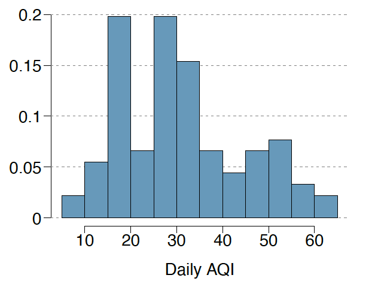
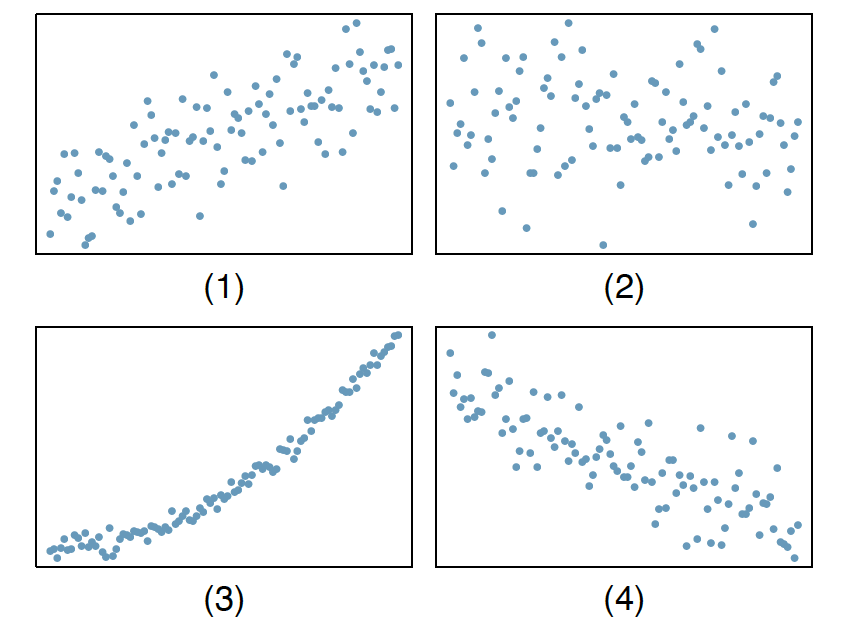

```{r setup, include=FALSE}
knitr::opts_chunk$set(echo = TRUE)
# \textcolor{blue}{}
```
## Question 1 
A migraine is a particularly painful type of headache, which patients sometimes wish to treat with acupuncture. To determine whether acupuncture relieves migraine pain, researchers conducted a randomized controlled study where 89 females diagnosed with migraine headaches were randomly assigned to one of two groups: treatment or control. 43 patients in the treatment group received acupuncture that is specifically designed to treat migraines. 46 patients in the control group received placebo acupuncture (needle insertion at non-acupoint locations). 24 hours after patients received acupuncture, they were asked if they were pain-free. Results are summarized in the contingency table below.
\begin{tabular}{clccc} 
& & \multicolumn{2}{c}{ Pain free } & \\
\cline { 2 - 4 } & & Yes & No & Total \\
\cline { 2 - 4 } Group & Treatment & 10 & 33 & 43 \\
& Control & 2 & 44 & 46 \\
\cline { 2 - 5 } & Total & 12 & 77 & 89
\end{tabular}  

(a) What percent of patients in the treatment group were pain-free 24 hours after receiving acupuncture? 

```{r}
10/43
```
  
  \textcolor{blue}{23.3\% of patients in the treatment group were pain-free 24 hours after receiving acupuncture.}  

(b) What percent were pain-free in the control group?  
  
```{r}
2/46
```
  
  \textcolor{blue}{4.3 \% were pain-free in the control group.}  
    
(c) In which group did a higher percentage of patients become pain-free 24 hours after receiving acupuncture? 
  
    \textcolor{blue}{Treatment group had a higher percentage of patients become pain-free 24 hours after receiving acupuncture.}  
  
(d) Your findings so far might suggest that acupuncture is an effective treatment for migraines for all people who suffer from migraines. However, this is not the only possible conclusion that can be drawn based on your findings so far. What is one other possible explanation for the observed difference between the percentages of patients that are pain-free 24 hours after receiving acupuncture in the two groups?  
    
    \textcolor{blue}{Since this study only includes female patients, it may be possible that women with migrainesare are more likely to have a positive reaction to acupuncture.}  

## Question 2 
The Buteyko method is a shallow breathing technique developed by Konstantin Buteyko, a Russian doctor, in 1952. Anecdotal evidence suggests that the Buteyko method can reduce asthma symptoms and improve quality of life. In a scientific study to determine the effectiveness of this method, researchers recruited 600 asthma patients aged 18-69 who relied on medication for asthma treatment. These patients were randomly split into two research groups: one practiced the Buteyko method and the other did not. Patients were scored on the quality of life, activity, asthma symptoms, and medication reduction on a scale from 0 to 10. On average, the participants in the Buteyko group experienced a significant.

(a) Identify the main research question of the study. 

    \textcolor{blue}{Is Buteyko method an effective approach to reduce asthma symptoms and improve quality of life}

(b) Who are the subjects in this study, and how many are included? 
    
    \textcolor{blue}{Asthma patients aged 18-69 who relied on medication for asthma treatment. 600 subjects are included.}

(c) What are the variables in the study? Identify each variable as numerical or categorical. If numerical, state whether the variable is discrete or continuous. If categorical, state whether the variable is ordinal. 

    \textcolor{blue}{quality of life score, activity score, asthma symptoms score, and medication reduction score. All of them are ordinal catrgorical variable. }
  
## Question 3 
Researchers hypothesized that a particular taste receptor in hummingbirds, T1R1-T1R3, played a primary role in dictating taste behavior; specifically, in determining which compounds hummingbirds detect as sweet. In a series of field tests, hummingbirds were presented simultaneously with two filled containers, one containing test stimuli and a second containing sucrose. The test stimuli included aspartame, erythritol, water, and sucrose. Aspartame is an artificial sweetener that tastes sweet to humans but is not detected by hummingbird T1R1-T1R3, while erythritol is an artificial sweetener known to activate T1R1-T1R3. Data were collected on how long a hummingbird drank from a particular container for a given trial, measured in seconds. For example, in one field test comparing aspartame and sucrose, a hummingbird drank from the aspartame container for 0.54 seconds and from the sucrose container for 3.21 seconds.

(a) Which tests are controls? Which tests are treatments? 

    \textcolor{blue}{Control test: hummingbirds are presented with either sucrose or water. Treatment test: hummingbirds are presented with test stimuli (aspartame, erythritol).}
    
(b) Identify the response variable(s) in the study. Are they numerical or categorical?
    
    \textcolor{blue}{How long a hummingbird drank from a particular container in seconds. The variable is numerical.}
    
(c) Describe the main research question.

    \textcolor{blue}{Dose T1R1-T1R3, a particular taste receptor in hummingbirds,  played a primary role in dictating taste behavior?}
    
  
## Question 4 
Echinacea has been widely used as an herbal remedy for the common cold, but previous studies evaluating its efficacy as a remedy has produced conflicting results. In a new study, researchers randomly assigned 437 volunteers to receive either a placebo or echinacea treatment before being infected with rhinovirus. Healthy young adult volunteers were recruited for the study from the University of Virginia community.

(a) Identify the population of interest and the sample in this study. 

    \textcolor{blue}{Population of interest is healthy young adult, Sample is 437 healthy young adult volunteers from the University of Virginia community.}
    
(b) Comment on whether or not the results of the study can be generalized to a larger population. 

    \textcolor{blue}{No. Sample of this study is healthy young adult from the University of Virginia and it is different from other healthy young adult. Also this sample only includes volunteers and may cause bias.}
    
(c) Can the findings of the study be used to establish causal relationships? Justify your answer. 

    \textcolor{blue}{Yes. The study is an experiment and participants are randomly assigned. The sample size is also large enough.}
    

## Question 5 
In order to assess the effectiveness of taking large doses of vitamin C in reducing the duration of the common cold, researchers recruited 400 healthy volunteers from staff and students at a university. A quarter of the patients were randomly assigned a placebo, and the rest were randomly allocated between 1g Vitamin C, 3g Vitamin C, or 3g Vitamin C plus additives to be taken at the onset of a cold for the following two days. All tablets had identical appearance and packaging. No significant differences were observed in any measure of cold duration or severity between the four medication groups, and the placebo group had the shortest duration of symptoms. 

(a) Was this an experiment or an observational study? Why? 

    \textcolor{blue}{Experiment. Subjects are randomly assigned.}
    
(b) What are the explanatory and response variables in this study?

    \textcolor{blue}{Explanatory variable is the type of pill. Response variable is whether duration of the common cold is reduced.}
    
(c) Participants are ultimately able to choose whether or not to use the pills prescribed to them. We might expect that not all of them will adhere to and take their pills. Does this introduce a confounding variable to the study? Explain your reasoning. 

    \textcolor{blue}{Yes. People may choose not to take vitamin. This will get confounding variable is the study only focus on people choose to take vitamin.}

## Question 6 
A researcher is interested in the effects of exercise on mental health and he proposes the following study: Use stratified random sampling to recruit 18-30, 31-40, and 41-55-year-olds from the population. Next, randomly assign half the subjects from each age group to exercise twice a week, and instruct the rest not to exercise. Conduct a mental health exam at the beginning and at the end of the study, and compare the results.

(a) What type of study is this? 

    \textcolor{blue}{Experiment Study}
    
(b) What are the treatment and control groups in this study? 

    \textcolor{blue}{Treatment group people exercising Two times each week. Control group is people not exercise.}
    
(c) Does this study make use of blocking? If so, what is the blocking variable?

    \textcolor{blue}{Yes.Blocking variable is age}
    
(d) Comment on whether or not the results of the study can be used to establish a causal relationship between exercise and mental health, and indicate whether or not the conclusions can be generalized to the population at large. 

    \textcolor{blue}{Results of the study could be used to establish a causal relationship between exercise and mental health.Conclusions can be generalized to the population as long as in age 18-55}
    
(e) Suppose you are given the task of determining if this proposed study should get funding. Would you have any reservations about the study proposal? 

    \textcolor{blue}{First, this study dose no specify blinding. Also, the measurement of mental health exam may cause bias. The duration is also not mentioned in this proposal. The definition of exercise is also ambiguous and may vary between individuals.}

## Question 7 
For each part, compare distributions (1) and (2) based on their means and standard deviations. You do not need to calculate these statistics; simply state how the means and the standard deviations compare. Make sure to explain your reasoning. Hint: It may be useful to sketch dot plots of the distributions.

(a) (1) 3, 5, 5, 5, 8, 11, 11, 11, 13
    (2) 3, 5, 5, 5, 8, 11, 11, 11, 20
    
    \textcolor{blue}{$\mu_{1}<\mu_{2},\sigma{1}<\sigma{2}$, all other value are same in (1) and (2) while the maximum value is larger in (2)}
  
(b) (1) -20, 0, 0, 0, 15, 25, 30, 30
    (2) -40, 0, 0, 0, 15, 25, 30, 30
    
    \textcolor{blue}{$\mu_{1}>\mu_{2},\sigma{1}<\sigma{2}$, all other value are same in (1) and (2) while the minimum value is larger in (1)}
  
(c) (1) 0, 2, 4, 6, 8, 10
    (2) 20, 22, 24, 26, 28, 30
    
    \textcolor{blue}{$\mu_{1}<\mu_{2},\sigma{1}=\sigma{2}$, every value in (2) is larger than (1), therefore mean value is smaller in (1). but there difference are the same, all in 2 increment. so standard deviation is the same}
  
(d) (1) 100, 200, 300, 400, 500
    (2) 0, 50, 300, 550, 600
    
    \textcolor{blue}{$\mu_{1}=\mu_{2},\sigma{1}<\sigma{2}$. sum of (1) and (2) are the same, so mean value are the same. (1) and (2) are centered at 300 while (2) has larger max and lower min, therefore sd is larger.}

## Question 8 
Daily air quality is measured by the air quality index (AQI) reported by the Environmental Protection Agency. This index reports the pollution level and what associated health effects might be a concern. The index is calculated for five major air pollutants regulated by the Clean Air Act and takes values from 0 to 300, where a higher value indicates lower air quality. AQI was reported for a sample of 91 days in 2011 in Durham, NC. The relative frequency histogram below shows the distribution of the AQI values on these days. 


(a) Based on the histogram, describe the distribution of daily AQI. 

    \textcolor{blue}{Most of the daily AQI lies between 15-35}

(b) Estimate the median AQI value of this sample. 
  
    \textcolor{blue}{since we have 91 data points, the median value should be the 46th value. according to the histogram, we can see that the median value lies in the interval [25,30]}  
  
(c) Would you expect the mean AQI value of this sample to be higher or lower than the median? Explain your reasoning. 

    \textcolor{blue}{The histogram skewed to the right. Therefore, the mean value is greater than the median value.}

## Question 9 
910 randomly sampled registered voters from Tampa, FL were asked if they thought workers who have illegally entered the US should be (i) allowed to keep their jobs and apply for US citizenship, (ii) allowed to keep their jobs as temporary guests workers but not allowed to apply for US citizenship, or (iii) lose their jobs and have to leave the country. The results of the survey by political ideology are shown below.
\begin{tabular}{llcccc} 
& & \multicolumn{3}{c}{ Political ideology } & \\
\cline { 2 - 5 } & & Conservative & Moderate & Liberal & Total \\
\cline { 2 - 5 } Response & (i) Apply for citizenship & 57 & 120 & 101 & 278 \\
& (ii) Guest worker & 121 & 113 & 28 & 262 \\
& (iii) Leave the country & 179 & 126 & 45 & 350 \\
& (iv) Not sure & 15 & 4 & 1 & 20 \\
\cline { 2 - 5 } & Total & 372 & 363 & 175 & 910
\end{tabular}
(a) What percent of these Tampa, FL voters identify themselves as conservatives?  

```{r}
372/910
```
  
  \textcolor{blue}{40.9\% of these Tampa voters identify themselves as conservatives}  
  
(b) What percent of these Tampa, FL voters are in favor of the citizenship option? 
```{r}
278/910
```
  \textcolor{blue}{30.5\% of these Tampa voters are in favor of the citizenship option}  
  
(c) What percent of these Tampa, FL voters identify themselves as conservatives and are in favor of the citizenship option? 

```{r}
57/910
```

  \textcolor{blue}{6.3\% of these Tampa voters identify themselves as conservatives and are in favor of the citizenship option}
  
(d) What percent of these Tampa, FL voters who identify themselves as conservatives are also in favor of the citizenship option? What percent of moderates share this view? What percent of liberals share this view? 
```{r}
57/372
```
  \textcolor{blue}{15.3\% of these Tampa, FL voters who identify themselves as conservatives are also in favor of the citizenship option}

```{r}
120/363
```
  \textcolor{blue}{33.1\% of these Tampa, FL voters who identify themselves as moderate are also in favor of the citizenship option}
  
```{r}
101/175
```

  \textcolor{blue}{57.7\% of these Tampa, FL voters who identify themselves as liberals are also in favor of the citizenship option}

## Question 10 


Indicate which of the plots shows a  

(a) positive association.  

    \textcolor{blue}{ (1) and (3) are positive association (1) is linear while (3) is not }  
  
(b) negative association.  

    \textcolor{blue}{(2) is negative association and it is linear } 
  
(c) no association.  

    \textcolor{blue}{(4) has no association} 
  
Also, determine if the positive and negative associations are linear or nonlinear. Each part may refer to more than one plot.


